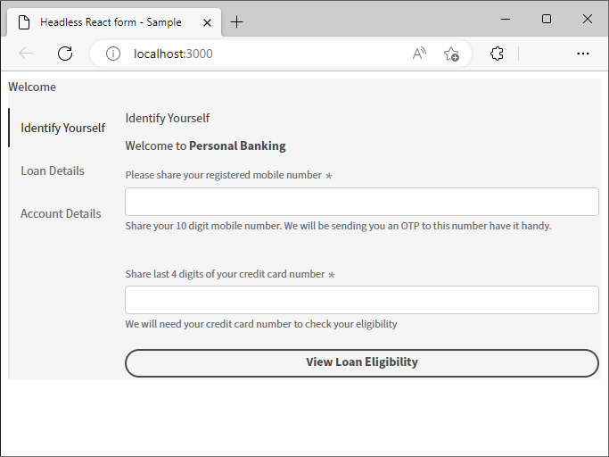

# Erstellen und Anzeigen einer Vorschau eines Headless-Formulars mit einer React-App {#introduction}

<!-- Missing image ALT image tags -->

Das Starterkit hilft Ihnen bei den ersten Schritten mit einer React-App. Es steht Ihnen frei, adaptive Headless-Formulare in einer Angular-, Vanilla JS- und anderen Entwicklungsumgebungen Ihrer Wahl zu entwickeln und zu verwenden.

Mit adaptiven Headless-Formularen zu beginnen ist ziemlich einfach und schnell. Klonen Sie das fertige React-Projekt, installieren Sie die Abhängigkeiten und führen Sie das Projekt aus. Sie haben ein adaptives Headless-Formular, das in eine React-App integriert ist, die ausgeführt wird. Sie können das React-Beispielprojekt verwenden, um adaptive Headless-Formulare zu erstellen und zu testen, bevor Sie sie in einer Produktionsumgebung bereitstellen.

Fangen wir an:

>[!NOTE]
>
>
> In diesem Erste-Schritte-Handbuch wird eine React-App verwendet. Sie können die Technologie oder Programmiersprache Ihrer Wahl verwenden, um adaptive Headless-Formulare zu verwenden.

## Bevor Sie beginnen {#pre-requisites}

Um eine React-App zu erstellen und auszuführen, muss auf Ihrem Computer Folgendes installiert sein:

* Installieren Sie die [neueste Version von Git](https://git-scm.com/downloads). Wenn Sie mit Git noch nicht vertraut sind, lesen Sie [Git installieren](https://git-scm.com/book/en/v2/Getting-Started-Installing-Git).

* Installieren Sie [Node.js 16.13.0 oder höher](https://nodejs.org/de/download/). <!-- URL is 404!! If you are new to Node.js, see [How to install Node.js](https://nodejs.dev/en/learn/how-to-install-nodejs). -->

## Erste Schritte

Nachdem die Anforderungen erfüllt sind, führen Sie die folgenden Schritte aus, um zu beginnen:

1. [Einrichten des Headless-Starter-Kits für adaptive Formulare](#setup)

1. [Vorschau des im Starter Kit enthaltenen adaptiven Headless-Formulars](#preview)

1. [Erstellen und Rendern eines eigenen adaptiven Headless-Formulars](#custom)


## &#x200B;1. Einrichten des Headless-Starter-Kits für adaptive Formulare {#install}

Das Starter Kit ist eine React-App mit einem Beispiel-Headless-adaptiven Formular und entsprechenden Bibliotheken. Verwenden Sie das Kit, um Ihre adaptiven Headless-Formulare und die entsprechenden React-Komponenten zu entwickeln und zu testen. Führen Sie die folgenden Befehle aus, um das Starter Kit für adaptive Headless-Formulare einzurichten:

1. Öffnen Sie eine Eingabeaufforderung und führen Sie den folgenden Befehl aus:

   ```shell
   git clone https://github.com/adobe/react-starter-kit-aem-headless-forms
   ```

   Der Befehl erstellt an Ihrem aktuellen Speicherort ein Verzeichnis **react-starter-kit-aem-headless** und klont die React-Starter-App für Headless Adaptive Forms darin. Neben den Konfigurationen und der Liste der Abhängigkeiten, die zum Rendern des Formulars erforderlich sind, enthält das Verzeichnis die folgenden wichtigen Inhalte:

   * **Beispielformular**: Das Starterkit enthält ein Beispielformular für einen Darlehensantrag. Um das in der App enthaltene Formular (Formulardefinition) anzuzeigen, öffnen Sie die Datei `/react-starter-kit-aem-headless-forms/form-definations/form-model.json`.
   * **Beispiel-React-Komponenten**: Das Starter-Kit enthält Beispiel-React-Komponenten für Rich-Text und Regler. Dieses Handbuch hilft Ihnen beim Erstellen eigener benutzerdefinierter Komponenten mit diesen Rich-Text- und Slider-Komponenten.
   * **Mappings.ts**: Mithilfe der Datei „mappings.ts“ können Sie benutzerdefinierte Komponenten Formularfeldern zuordnen. Ordnen Sie beispielsweise ein numerisches Schrittfeld einer Bewertungskomponente zu.
   * **Umgebungskonfigurationen**: Mit Umgebungskonfigurationen können Sie ein im Starterkit enthaltenes Formular wiedergeben oder ein Formular von einem AEM Forms-Server abrufen.

   

   >[!NOTE]
   >
   > 
   > Beispiele in Dokumenten basieren auf VSCode. Sie können auch einen beliebigen einfachen Texteditor für Code verwenden.


1. Navigieren Sie zum Verzeichnis **react-starter-kit-aem-headless-forms** und führen Sie den folgenden Befehl aus, um die Abhängigkeiten zu installieren:

   ```shell
   npm install
   ```

   Der Befehl lädt alle Pakete und Bibliotheken herunter, die zum Erstellen und Ausführen der App erforderlich sind, einschließlich der Headless-Bibliotheken für adaptive Formulare (@aemforms/af-react-renderer, @aemforms/af-react-components, @adobe/react-spectrum). Anschließend werden Validierungen ausgeführt und die Daten für jede Formularinstanz beibehalten.


   


## &#x200B;2. Vorschau des adaptiven Headless-Formulars {#preview}

Nach der Einrichtung des Starter Kits können Sie eine Vorschau des adaptiven Headless-Beispielformulars anzeigen und es durch Ihr eigenes benutzerdefiniertes Formular ersetzen. Sie können auch das Starterkit konfigurieren, um ein Formular von einem AEM Forms-Server abzurufen. So zeigen Sie eine Vorschau des Formulars an

1. Benennen Sie die Datei `env_template` in `.env` um. Stellen Sie außerdem sicher, dass die Option USE_LOCAL_JSON auf „true“ gesetzt ist.

   

   <!-- The options in the .env file help you configure source of the forms definantion (.JSON):
    *  To source forms definantion (.JSON) from an AEM Server, set USE_LOCAL_JSON option to false, use the AEM_URL option to specify URL  of your AEM Server, and set the AEM_FORM_PATH option to path of your adaptive form.
    *  To source forms definantion (.JSON) form-model.json file included in the starter-kit, set USE_LOCAL_JSON option to false. -->

1. Verwenden Sie den folgenden Befehl, um die App auszuführen:

   ```shell
     npm start
   ```


   Mit diesem Befehl wird ein lokaler Entwicklungs-Server gestartet und das in der Starter-App enthaltene adaptive Headless-Beispielformular in Ihrem Standard-Webbrowser geöffnet.

   

   Alles bereit! Sie können jetzt mit der Entwicklung eines benutzerdefinierten adaptiven Headless-Formulars beginnen.

   <!--  As you know, in a headless form the form data and logic are separate from the presentation layer and can be used by any client that can make HTTP requests, such as a mobile app, a static site, or a different web application. The form is often managed and stored on a server, which serves as the backend for the form. The client sends requests to the server to retrieve the form, submit data, and receive updated form data. This allows for greater flexibility and integration with different technologies. You can store and retrive a Headless Adaptive form on an AEM Server  -->

## &#x200B;3. Erstellen und Rendern Ihres eigenen adaptiven Headless-Formulars{#custom}

Ein adaptives Headless-Formular stellt das Formular und seine Komponenten (z. B. Felder und Schaltflächen) im JSON-Format (JavaScript Object Notation) dar. Der Vorteil der Verwendung des JSON-Formats besteht darin, dass es einfach geparst und von verschiedenen Programmiersprachen verwendet werden kann, was es zu einer bequemen Möglichkeit macht, Formulardaten zwischen Systemen auszutauschen. Öffnen Sie die `/react-starter-kit-aem-headless-forms/form-definations/form-model.json`-Datei, um das in der App enthaltene Beispiel-Headless-adaptive Formular anzuzeigen.

Erstellen wir ein `Contact Us` Formular mit vier Feldern: „Name“, „E-Mail“, „Kontaktnummer“ und „Nachricht“. Die Felder werden als Objekte (Elemente) innerhalb der JSON-Datei definiert, wobei jedes Objekt (Element) Eigenschaften aufweist, wie „Typ“, „Bezeichnung“, „Name“ und „Erforderlich“. Das Formular enthält auch eine Schaltfläche vom Typ „Senden“. Hier finden Sie die JSON für das Formular.


```JSON
{
  "afModelDefinition": {
    "adaptiveform": "0.10.0",
    "items": [
      {
        "fieldType": "text-input",
        "label": {
          "value": "Name"
        },
        "name": "name"
      },
      {
        "fieldType": "text-input",
        "format": "email",
        "label": {
          "value": "Email"
        },
        "name": "email"
      },
      {
        "fieldType": "text-input",
        "format": "phone",
        "pattern": "[0-9]{10}",
        "label": {
          "value": "Contact Number"
        },
        "name": "Phone"
      },
      {
        "fieldType": "multiline-input",
        "label": {
          "value":"Message"
        },
        "name": "message"
      },
      {
        "fieldType": "button",
        "label":{
          "value": "Submit"
        },
        "name":"submit",
        "events":{
          "click": "submitForm()"
        }
      }
    ],
    "action": "https://eozrmb1rwsmofct.m.pipedream.net",
    "description": "Contact Us",
    "title": "Contact Us",
    "metadata": {
      "grammar": "json-formula-1.0.0",
      "version": "1.0.0"
    }
  }
}
```

>[!NOTE]
>
> * Das Attribut „afModelDefinition“ ist nur für React-Apps erforderlich und ist nicht Teil der Formulardefinition.
> * Sie können die JSON für das Formular manuell erstellen oder den [AEM-Editor für adaptive Formulare (WYSIWYG-Editor für adaptive Formulare)](create-a-headless-adaptive-form.md) verwenden, um die Formular-JSON zu erstellen und bereitzustellen. In einer Produktionsumgebung verwenden Sie AEM Forms, um die Formular-JSON bereitzustellen, mehr dazu später.
> * In diesem Tutorial wird „https://pipedream.com/“ zum Testen der Formularübermittlung verwendet. Sie verwenden Ihre eigenen Endpunkte oder Endpunkte von Drittanbietern, die von Ihrem Unternehmen genehmigt wurden, um die Daten aus einem adaptiven Headless-Formular zu erhalten.


Um das Formular wiederzugeben, ersetzen Sie das Beispiel-JSON-`/react-starter-kit-aem-headless-forms/form-definations/form-model.json` für adaptive Headless-Formulare durch das obige JSON, speichern Sie die Datei, warten Sie, bis das Starter-Kit kompiliert und das Formular aktualisiert wird.


<!-- Your form is ready. Let's add some validations and make "Name", "Email", and "Message" fields mandatory. -->

Sie haben das adaptive Headless-Formular erfolgreich gerendert.


## Bonus

Legen wir den Titel der Web-Seite, die das Formular hostet, auf `Contact Us | WKND Adventures and Travel` fest. Um den Titel zu ändern, öffnen Sie die Datei _react-starter-kit-aem-headless-forms/public/index.html_ zur Bearbeitung und legen Sie den Titel fest.


## Nächster Schritt

Standardmäßig verwendet das Starterkit [Adobe](https://spectrum.adobe.com/)-Komponenten zum Rendern des Formulars. Sie können eigene Komponenten oder Komponenten von Drittanbietern erstellen und verwenden. Beispielsweise die Google Material-Benutzeroberfläche oder die Chakra-Benutzeroberfläche.

Rufen wir [Google Material-Benutzeroberfläche verwenden](use-google-material-ui-react-components-to-render-a-headless-form.md) auf, um das `Contact Us` Formular zu rendern.


