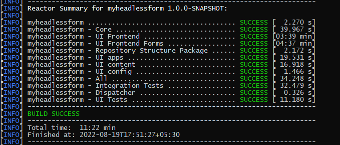
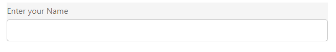
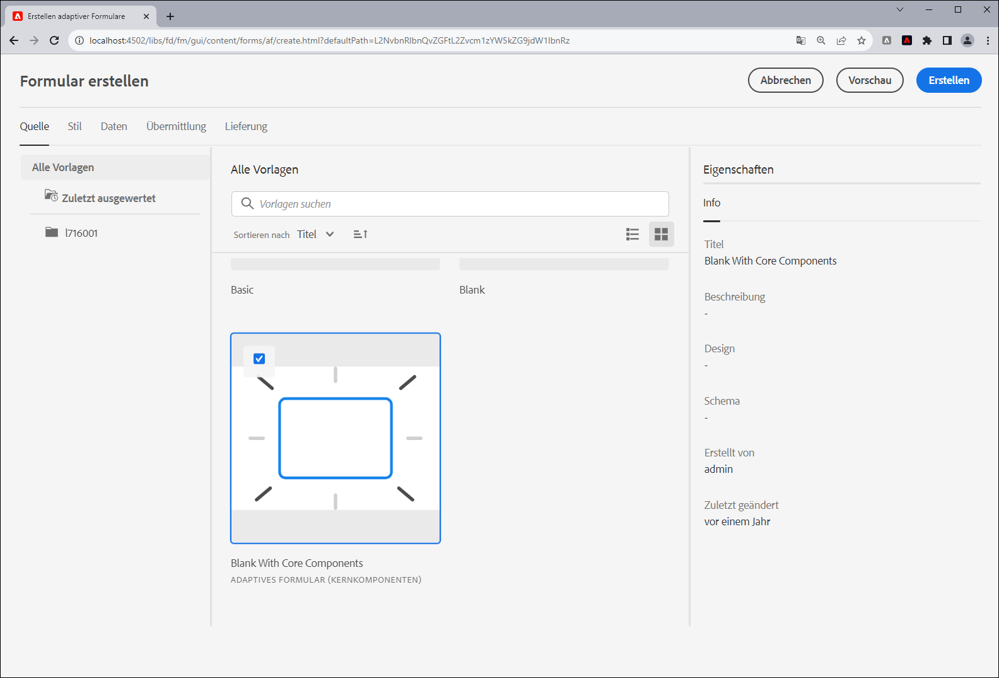

# Erstellen Ihres ersten adaptiven Headless-Formulars

Verwenden Sie adaptive Adobe Experience Manager Headless-Formulare, um Formularanwendungen mithilfe der Frontend-Benutzeroberfläche wie React zu erstellen, und verwenden Sie Forms Web SDK für Funktionen wie Statusverwaltung, Validierung und Integrationen mit verschiedenen anderen Touchpoints.

Beispiel: Das Unternehmen We.Org möchte die Journey seiner Kundenanmeldung digitalisieren. Sein Entwicklungs-Team ist mit der Verwendung von Angular zum Erstellen von Frontend-Lösungen sehr vertraut. Das Unternehmen möchte ein benutzerdefiniertes Frontend erstellen, während es die Formularüberprüfung und elektronische Signaturen in spezielle Lösungen auslagert.

Adaptive Adobe Experience Manager Headless-Formulare bieten diesen Unternehmen die Möglichkeit, Formulare mithilfe ihres vorhandenen Fachwissens in Frontend-Sprachen zu erstellen und gleichzeitig die Verwendung von Backend-Funktionen zur Erstellung von Formularen im Unternehmensbereich zu unterstützen.

<!-- >>[!VIDEO](https://video.tv.adobe.com/v/341011/) -->

<!--   -->

## Bevor Sie beginnen

* Richten Sie die [Entwicklungsumgebung](setup-development-environment.md) ein, damit Sie ein adaptives Headless-Formular auf Ihrem lokalen Computer erstellen und testen können.
* Die folgende Software muss auf Ihrem lokalen Entwicklungscomputer installiert sein:
   * [Java Development Kit 11](https://experience.adobe.com/#/downloads/content/software-distribution/en/general.html?1_group.propertyvalues.property=.%2Fjcr%3Acontent%2Fmetadata%2Fdc%3AsoftwareType&1_group.propertyvalues.operation=equals&1_group.propertyvalues.0_values=software-type%3Atooling&fulltext=Oracle%7E+JDK%7E+11%7E&orderby=%40jcr%3Acontent%2Fjcr%3AlastModified&orderby.sort=desc&layout=list&p.offset=0&p.limit=14)
   * [Die neueste Version von Git](https://git-scm.com/downloads). Wenn Sie mit Git noch nicht vertraut sind, lesen Sie [Installieren von Git](https://git-scm.com/book/en/v2/Getting-Started-Installing-Git).
   * [Node.js 16.13.0 oder höher](https://nodejs.org/de/download/). <!-- URL is 404! If you are new to Node.js, see [How to install Node.js](https://nodejs.dev/en/learn/how-to-install-nodejs). -->
   * [Maven 3.6 oder höher](https://maven.apache.org/download.cgi). Wenn Sie mit Maven noch nicht vertraut sind, lesen Sie [Installieren von Apache Maven](https://maven.apache.org/install.html).


## Verwenden des Archetyp-Projekts zum Erstellen eines adaptiven Headless-Formulars

Das Archetyp-Projekt ist eine Maven-basierte Vorlage. Es wird ein minimales Projekt erstellt, das auf Best Practices für die ersten Schritte mit Headless-adaptiven Formularen basiert. Es enthält auch Funktionen für adaptive Headless-Formulare für Forms as a Cloud Service und lokale Entwicklungsumgebungen. Es ist erforderlich, das auf dem Archetyp 37 oder höher basierende Projekt während der Betaphase zu erstellen und bereitzustellen. Nach der Betaphase ist das Projekt nur für Anpassungen erforderlich.

Führen Sie die folgenden Schritte aus, um Ihr erstes adaptives Headless-Formular zu erstellen und zu rendern:

1. [Erstellen und Bereitstellen eines AEM Archetype-basierten Projekts](#create-an-archetype-based-project)
1. [Bereitstellen des Projekts für das AEM SDK](#deploy-the-project-to-a-local-development-environment)
1. [Erstellen Sie ein JSON-Schema des adaptiven Headless-Formulars und laden Sie es in Ihre AEM SDK-Instanz hoch](#create-add-json-representation-of-headless-adaptive-forms)
1. [Erstellen eines adaptiven Formulars basierend auf der Vorlage „Leer mit Kernkomponenten“](#create-adaptive-form-with-blank-with-core-components-template)


### &#x200B;1. Erstellen und Bereitstellen eines auf einem Archetyp basierenden Projekts von AEM {#create-an-archetype-based-project}

Führen Sie je nach Betriebssystem den folgenden Befehl aus, um ein Experience Manager Forms as a Cloud Service-Projekt zu erstellen. Verwenden Sie den Archetyp Version 37 oder höher. Informationen zur neuesten Version des Archetyps finden Sie in der [Archetyp-Dokumentation](https://experienceleague.adobe.com/de/docs/experience-manager-core-components/using/developing/archetype/overview).

**Microsoft Windows**

1. Öffnen Sie die Eingabeaufforderung mit Administratorrechten (Führen Sie die Eingabeaufforderung oder die Bash-Shell als Admin aus)
1. Führen Sie den folgenden Befehl aus:

   ```shell
     mvn -B org.apache.maven.plugins:maven-archetype-plugin:3.2.1:generate ^
     -D archetypeGroupId=com.adobe.aem ^
     -D archetypeArtifactId=aem-project-archetype ^
     -D archetypeVersion=37 ^
     -D appTitle=myheadlessform ^
     -D appId=myheadlessform ^
     -D groupId=com.myheadlessform ^
     -D includeFormsenrollment="y" ^
     -D includeFormsheadless="y" 
   ```

   * Passen Sie `appTitle` an, um den Titel und die Komponentengruppen festzulegen.
   * Passen Sie `appId` an, um die Maven-Artefakt-ID (artifactId), die Namen der Komponenten-, Konfigurations- und Inhaltsordner sowie die Namen der Client-Bibliotheken festzulegen.
   * Passen Sie `groupId` an, um die Maven-Gruppen-ID (groupId) und das Java-Quellpaket festzulegen.
   * Verwenden Sie die Option `includeFormsenrollment=y` zum Einschließen von Forms-spezifischen Konfigurationen, Designs, Vorlagen, Kernkomponenten und Abhängigkeiten, die zum Erstellen adaptiver Formulare erforderlich sind.
   * Durch Verwenden der Option `includeFormsheadless=y` werden Formular-Kernkomponenten und -Abhängigkeiten einbezogen, die für die Verwendung der Funktion für adaptive Headless-Formulare erforderlich sind. Wenn Sie diese Option aktivieren, sind folgende Punkte enthalten:
      * Die Vorlage **Leer mit Kernkomponenten** mit [Kernkomponenten](https://experienceleague.adobe.com/de/docs/experience-manager-core-components/using/introduction).
      * Ein Frontend-React-Modul, `ui.frontend.react.forms.af`. Dies hilft Ihnen beim Rendern eines adaptiven Headless-Formulars in einer React-App.


**Apple macOS oder ®**:

1. Öffnen Sie das Terminal als Root-Benutzer. So können Sie Befehle mit Administratorrechten ausführen. Sie können nach dem Öffnen des Terminalfensters, um Befehle mit Administratorrechten auszuführen, auch den Befehl `sudo root` verwenden.
1. Führen Sie den folgenden Befehl aus:

   ```shell
     mvn -B org.apache.maven.plugins:maven-archetype-plugin:3.2.1:generate \
     -D archetypeGroupId=com.adobe.aem \
     -D archetypeArtifactId=aem-project-archetype \
     -D archetypeVersion=37 \
     -D appTitle=myheadlessform \
     -D appId=myheadlessform \
     -D groupId=com.myheadlessform \
     -D includeFormsenrollment="y" \
     -D includeFormsheadless="y"  
   ```

   * Passen Sie `appTitle` an, um den Titel und die Komponentengruppen festzulegen.
   * Passen Sie `appId` an, um die Maven-Artefakt-ID (artifactId), die Namen der Komponenten-, Konfigurations- und Inhaltsordner sowie die Namen der Client-Bibliotheken festzulegen.
   * Passen Sie `groupId` an, um die Maven-Gruppen-ID (groupId) und das Java-Quellpaket festzulegen.
   * Verwenden Sie die Option `includeFormsenrollment=y` zum Einschließen von Forms-spezifischen Konfigurationen, Designs, Vorlagen, Kernkomponenten und Abhängigkeiten, die zum Erstellen adaptiver Formulare erforderlich sind.
   * Durch Verwenden der Option `includeFormsheadless=y` werden Formular-Kernkomponenten und -Abhängigkeiten einbezogen, die für die Verwendung der Funktion für adaptive Headless-Formulare erforderlich sind. Wenn Sie diese Option aktivieren, sind folgende Punkte enthalten:
      * Die Vorlage **Leer mit Kernkomponenten** mit [Kernkomponenten](https://experienceleague.adobe.com/de/docs/experience-manager-core-components/using/introduction).
      * Ein Frontend-React-Modul, `ui.frontend.react.forms.af`. Dies hilft Ihnen beim Rendern eines adaptiven Headless-Formulars in einer React-App.

Nach erfolgreichem Abschluss des Befehls wird ein Projektordner mit dem im `appID` angegebenen Namen erstellt. Wenn Sie beispielsweise `appID` mit dem Wert `myheadlessform` verwenden, wird ein Ordner mit dem Namen `myheadlessform` erstellt. Er enthält das auf dem Archetyp basierende Projekt.


### &#x200B;2. Bereitstellen des Projekts für das AEM SDK {#deploy-the-project-to-a-local-development-environment}

Wenn Sie das Projekt in Ihrer AEM SDK-Instanz bereitstellen, werden die Funktion für adaptive Headless-Formulare, die Vorlage **Leer mit Kernkomponenten** und andere Ressourcen, die im Projekt enthalten sind, zu Ihrer Entwicklungsumgebung hinzugefügt. <!-- Deploy the project to your local development environment to locally create Headless Adaptive Forms. or deploy directly to your Forms as a Cloud Service environment. !--> So stellen Sie Ihre AEM SDK-Instanz bereit:

1. Öffnen Sie die Eingabeaufforderung. Wenn Sie mit Windows arbeiten, öffnen Sie die Eingabeaufforderung mit Administratorrechten (Eingabeaufforderung oder [Git-Bash-Shell](https://khushwantsehgal.wordpress.com/2022/06/29/check-if-git-bash-is-running-in-administrator-mode/) als Admin ausführen).

1. Navigieren Sie zu dem im vorherigen Schritt erstellten Projektverzeichnis. Zum Beispiel: `/myheadlessform`

   

1. Führen Sie den folgenden Befehl aus:

   ```shell
   mvn -PautoInstallPackage clean install
   ```

   Warten Sie auf die Meldung „BUILD SUCCESS“.
   

   Es kann lange dauern, die Dateiabhängigkeiten zu beheben und das Projekt bereitzustellen. Wenn bei der Bereitstellung des Projekts ein Fehler auftritt, finden Sie im Artikel [Fehlerbehebung](troubleshooting.md) Informationen zu häufigen Problemen und deren Behebung.


<!-- *  To learn how to deploy code to AEM as a Cloud Service, see the video in [Deploying to AEM as a Cloud Service]https://experienceleague.adobe.com/docs/experience-manager-cloud-service/content/implementing/deploying/overview.html?lang=en#coding-against-the-right-aem-version) article : -->


### &#x200B;3. Erstellen des JSON-Schemas des adaptiven Headless-Formulars und Hochladen in Ihre AEM SDK-Instanz {#create-add-json-representation-of-headless-adaptive-forms}

Ein adaptives Headless-Formular wird als JSON-Datei dargestellt. Sie können ein Beispielformular aus [Storybook) abrufen ](https://opensource.adobe.com/aem-forms-af-runtime/storybook/?path=/story/reference-examples--contact) das Beispielformular verwenden, das in den Projektarchetyp unter `[Archetype Project]\ui.content\src\main\content\jcr_root\content\dam\myheadlessform\af_model_sample.json` eingeschlossen ist. Dieses Dokument verwendet das Formular [Einführung](https://opensource.adobe.com/aem-forms-af-runtime/storybook/?path=/story/reference-examples--introduction) aus dem Storybook. Es ist ein Formular mit einem einzelnen Feld, mit dem Sie schnell mit adaptiven Headless-Formularen beginnen können. <!-- The [specifications](/help/assets/Headless-Adaptive-Form-Specification.pdf) document provides detailed information about various components, rules, and constraints for Headless Adaptive Forms -->

So erstellen Sie das Schema und laden es hoch:

1. Erstellen Sie eine Nur-Text-Datei mit der Erweiterung `.json`. Beispiel: `myfirstform.json`. Sie können die Datei an einer beliebigen Stelle in Ihrem Dateisystem oder in Ihrem AEM Archetyp-basierten Projekt unter `\<project-name>\ui.content\src\main\content\jcr_root\content\dam\myheadlessform\<formname>.json` erstellen
1. Fügen Sie Ihrer `.json`-Datei folgenden Code hinzu und speichern Sie die Änderung:

   ```JSON
   {
     "adaptiveform": "0.10.0",
     "items": [
       {
         "fieldType": "text-input",
         "label": {
           "value": "Enter your Name"
         },
         "name": "textInput"
       }
     ],
     "metadata": {
       "grammar": "json-formula-1.0.0",
       "version": "1.0.0"
     }
   }
   ```

   Es wird ein einzelnes Feld zum Formular hinzugefügt:

   

1. Melden Sie sich bei Ihrer [lokalen AEM SDK-Instanz](setup-development-environment.md#setup-author-instance) an
1. Gehen Sie zu „Adobe Experience Manager“ > „Forms“ > „Formulare und Dokumente“. Tippen Sie auf „Erstellen“ > „Datei hochladen“.
1. Wählen Sie die in Schritt 2 erstellte `.json` aus und laden Sie sie hoch. Sie können jetzt das adaptive Headless-Formular erstellen. Wenn Sie die JSON-Datei in Ihrem AEM Archetyp-basierten Projekt unter `\<project-name>\ui.content\src\main\content\jcr_root\content\dam\myheadlessform\<formname>.json` speichern, können Sie `mvn -PautoInstallPackage clean install` verwenden, um das Projekt mitsamt `<formname>.json` in Ihrem AEM SDK bereitzustellen.

Wenn beim Hochladen der `.json` ein Fehler auftritt, stellen Sie sicher, dass das [AEM-Archetyp-Projekt erfolgreich bereitgestellt wurde](#deploy-the-project-to-a-local-development-environment).

<!-- 1. Open the [contact form](https://opensource.adobe.com/aem-forms-af-runtime/storybook/?path=/story/reference-examples--contact) and tap the [](faq.md#storybook-example) icon on bottom-right side of the Storybook page to view the source code of the headless . 

You can use [Adaptive Forms builder extension for Visual Studio Code](/help/setup-development-environment.md#microsot-visual-studio-code-extension-for-headless-adaptive-forms) to build a JSON schema of your Headless Adaptive Forms. 

You can see [Storybook](https://opensource.adobe.com/aem-forms-af-runtime/storybook/?path=/story/reference-examples--introduction) for sample JSON schemas and list of components, attributes, and properties. You can also see the [specifications document](/help/assets/Headless-Adaptive-Form-Specification.pdf) for detailed information on all the components, constraints, and methods available to define Headless Adaptive Forms.

File extension of a JSON schema of Headless Adaptive Forms is .json. For example, formname.json. Create or add the file to your AEM Archetype based project. For example, `\myheadlessform\ui.content\src\main\content\jcr_root\content\dam\myheadlessform\home-loan.json` -> 

### 3. Deploy the project to a local development environment {#deploy-the-project-to-a-local-development-environment}

You can deploy the project to local development environment. It adds Headless Adaptive Forms functionality, the **Blank with core components** template, JSON schema of form, and other resources included in the project to your development environment. <!-- Deploy the project to your local development environment to locally create Headless Adaptive Forms. or deploy directly to your Forms as a Cloud Service environment. To deploy to your local development environment, use the following command: 

    `mvn -PautoInstallPackage clean install`

If you are on Windows, run the above with Administrative privileges (Run command prompt or [bash shell as an administrator](https://khushwantsehgal.wordpress.com/2022/06/29/check-if-git-bash-is-running-in-administrator-mode/)). For the complete list of commands, see [Building and Installing](https://experienceleague.adobe.com/docs/experience-manager-core-components/using/developing/archetype/using.html?lang=en#building-and-installing).
    
<!-- *  To learn how to deploy code to AEM as a Cloud Service, see the video in [Deploying to AEM as a Cloud Service]https://experienceleague.adobe.com/docs/experience-manager-cloud-service/content/implementing/deploying/overview.html?lang=en#coding-against-the-right-aem-version) article : -->

### &#x200B;4. Erstellen eines adaptiven Formulars basierend auf der Vorlage „Leer mit Kernkomponenten“ {#create-adaptive-form-with-blank-with-core-components-template}

1. Melden Sie sich bei Ihrer [AEM SDK-Instanz](http://localhost:4502/) an.

1. Gehen Sie zu „Adobe Experience Manager“ > „Forms“ > „Formulare und Dokumente“.

1. Tippen Sie auf „Erstellen“ und wählen Sie „Adaptives Formular“. Wählen Sie die Vorlage **Leer mit Kernkomponenten** aus und tippen Sie auf „Erstellen“.

   

1. Geben Sie die Werte für die folgenden Eigenschaftenfelder an. Die Felder „Titel“ und „Name“ sind obligatorisch.

   * **Titel:** Gibt den Anzeigenamen des Formulars an. Der Titel erleichtert Ihnen die Identifizierung des Formulars in der Benutzeroberfläche von Experience Manager Forms.
   * **Name:** Gibt den Namen des Formulars an. Im Repository wird ein Knoten mit dem angegebenen Namen erstellt. Wenn Sie mit der Eingabe des Titels beginnen, wird automatisch ein Wert für das Feld „Name“ vorgeschlagen. Sie können den vorgeschlagenen Wert gegebenenfalls ändern. Im Feld „Name“ dürfen nur alphanumerische Zeichen, Bindestriche und Unterstriche eingegeben werden. Alle ungültigen Eingaben werden durch Bindestriche ersetzt.

1. Tippen Sie auf „Erstellen“. Ein adaptives Formular wird erstellt.

Wenn die Vorlage **Leer mit Kernkomponenten** nicht angezeigt wird, stellen Sie sicher, dass das [AEM-Archetyp-Projekt erfolgreich bereitgestellt wurde](#deploy-the-project-to-a-local-development-environment).

### &#x200B;5. Konfigurieren des adaptiven Formulars für die Verwendung des JSON-Schemas {#configure-adaptive-form-to-use-the-JSON-representation}

Das im vorherigen Schritt erstellte adaptive Formular ist leer. Konfigurieren Sie das adaptive Formular für die Verwendung des JSON-Schemas:

1. Melden Sie sich bei Ihrer [AEM SDK-Instanz](http://localhost:4502/) an.

1. Gehen Sie zu „Adobe Experience Manager“ > „Forms“ > „Formulare und Dokumente“. Wählen Sie das im vorherigen Schritt erstellte adaptive Formular aus und tippen Sie auf Bearbeiten . Das adaptive Formular wird im Editor geöffnet.

1. Tippen Sie auf die Komponente „Adaptive Formulare – Container“ und dann auf „Eigenschaften“. Der Eigenschaften-Explorer wird in der Seitenleiste angezeigt.

1. Erweitern Sie im Eigenschaften-Explorer das Akkordeon STANDARD und geben Sie den Pfad des JSON-Schemas an, das in einem vorherigen Schritt für die Option Forms Runtime Document Path hochgeladen wurde. Die Container-Komponente zeigt eine Ausgabedarstellung des Formulars an.

1. Erweitern Sie im Eigenschaften-Explorer das Akkordeon Übermittlung und legen Sie eine Übermittlungsaktion für das adaptive Formular fest. Ihr Formular kann jetzt in einer React-App verwendet werden.

1. So rendern Sie das Formular auf Ihrem lokalen Entwicklungs-Computer:

   1. Öffnen Sie die Datei `[Archetype project]\ui.frontend.react.forms.af\.env` und legen Sie den Pfad des Formulars fest. Beispiel: /content/forms/af/contact

   1. Öffnen Sie die Eingabeaufforderung, navigieren Sie zum Projekt „ui.frontend.react.forms.af“ und führen Sie den folgenden Befehl aus:

      `npm run start`

   1. Öffnen Sie nach Abschluss des Vorgangs :3000 localhost in Ihrem Browser-Fenster, um ein gerendertes adaptives Headless-Formular anzuzeigen.
   1. Um die Übermittlungsfunktion zu testen, melden Sie sich bei Ihrem AEM Forms-Server an und verwenden Sie die Option **HTML-Vorschau** des Formulars, um das Formular im Vorschaumodus zu öffnen.

Das [Storybook](https://opensource.adobe.com/aem-forms-af-runtime/storybook/) enthält eine Liste der Komponenten und Regeln, die für verschiedene adaptive Headless-Forms festgelegt werden können, sowie einige Beispiele für das JSON-Schema von Headless Adaptive Forms. Sie können auch das Dokument [Spezifikationen](/help/assets/Headless-Adaptive-Form-Specification.pdf) lesen, um mehr über verschiedene Regeln und Eigenschaften in Bezug auf Headless Adaptive Forms zu erfahren.
