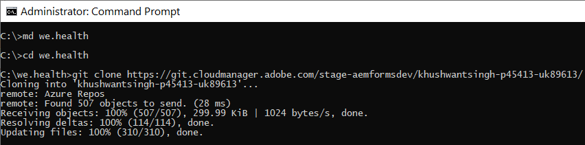

# Einrichten einer Entwicklungsumgebung für adaptive Headless-Formulare in Cloud Service

<span class="preview"> Dieser Artikel ist **IN BEARBEITUNG**.</span>


Bereit zum Erstellen und Testen von adaptiven Headless-Formularen in Cloud Service? Aktivieren Sie Formulare für Ihr Cloud Service-Programm und legen Sie los.

## Vorbereitung

* Installieren Sie [neueste Version von Git](https://git-scm.com/downloads) auf Ihrem lokalen Computer. Wenn Sie mit Git noch nicht vertraut sind, lesen Sie [Installieren von Git](https://git-scm.com/book/en/v2/Getting-Started-Installing-Git). Sie verwenden das Git-Repository, um die in Ihrer lokalen Entwicklungsumgebung entwickelten Formulare und den benutzerdefinierten Code in Ihre Cloud Service-Entwicklungsumgebung zu übertragen.

* Installieren Sie [Node.js 16.13.0 oder höher](https://nodejs.org/de/download/) auf Ihrem lokalen Computer. <!-- URL IS 404! If you are new to Node.js, see [How to install Node.js](https://nodejs.org/en/learn/how-to-install-nodejs). -->


* Erstellen Sie ein AEM as a Cloud Service-Programm: Folgen Sie den Schritten 1 bis 7 des Artikels zum [Erstellen von Programmen](https://experienceleague.adobe.com/en/docs/experience-manager-cloud-service/content/onboarding/demo-add-on/create-program#create-program), um ein Programm für Ihre Organisation zu erstellen.

* Aktivieren [ den Vorabversionskanal für Ihr Cloud Service-Programm](https://experienceleague.adobe.com/en/docs/experience-manager-cloud-service/content/release-notes/prerelease#cloud-environments).

## Einrichten des Arbeitsablaufs

Um adaptive Headless-Formulare in Ihrer Forms as a Cloud Service Sandbox zu aktivieren, aktivieren Sie `Forms - Digital enrolment` Lösung für Ihr AEM Cloud Service-Programm. Erstellen Sie dann auf Ihrem lokalen Computer ein Projekt vom Typ 37 oder höher und übertragen Sie es in Ihre Forms as a Cloud Service-Umgebung. Der gesamte Prozess läuft wie folgt ab:


### &#x200B;1. Aktivieren Sie Forms für Ihr Programm

<table style="table-layout:auto">
<tr>
  <td>
  1. Melden Sie sich bei <a href="https://experience.adobe.com/" >https://experience.adobe.com/</a> an und wählen Sie die Option <b>Experience Manager</b>.

  </td>
  <td>
    <a href="https://experienceleague.adobe.com/en/docs/experience-manager-cloud-service/content/onboarding/demo-add-on/create-program#create-program">
      
    </a>
    <br>
  </td>
</tr>
<tr>
  <td>
  &#x200B;2. Klicken Sie für die Option <b>Cloud Manager</b> auf <b>Starten. </b> Eine Liste der Programme für Ihre Organisation wird angezeigt.
  </td>
  <td>
    <a href="https://experienceleague.adobe.com/en/docs/experience-manager-cloud-service/content/onboarding/demo-add-on/create-program#create-program">
      
    </a>
    <br>
  </td>
</tr>
<tr>
  <td>
    &#x200B;3. Tippen Sie für Ihr Programm auf das Symbol „…“ und wählen Sie die Option <b>Programm bearbeiten</b>. Ein Dialogfeld wird angezeigt. 
  </td>
  <td>
    <a href="https://experienceleague.adobe.com/en/docs/experience-manager-cloud-service/content/onboarding/demo-add-on/create-program#create-program">
      
    </a>
    <br>
  </td>
</tr>
<tr>
  <td>
    &#x200B;4. Navigieren Sie im Dialogfeld „Programm bearbeiten“ zur <b>Registerkarte „Lösungen und Add-ons“</b>, wählen Sie die Option <b>Forms – Digitale Registrierung</b> und tippen Sie auf <b>Aktualisieren</b>. 
  </td>
  <td>
    <a href="https://experienceleague.adobe.com/en/docs/experience-manager-cloud-service/content/onboarding/demo-add-on/create-program#create-program">
      
    </a>
    <br>
  </td>
</tr>
</table>

### &#x200B;2. Klonen Sie das Git-Repository Ihres Programms auf Ihrem lokalen Computer

Jedes AEM as a Cloud Service-Programm hat ein Git-Repository. Damit können Sie benutzerdefinierten Code und Assets von einem lokalen Computer in Ihre Cloud Service-Umgebung hochladen. Während des Setups verwendet Adobe das Git-Repository, um Headless-Code für adaptive Formulare, Vorlagen und andere Informationen von Ihrem lokalen Computer in Ihr Cloud Service-Programm zu übertragen. Das Klonen des Cloud Service-Git-Repositorys auf Ihrem lokalen Computer ist der erste Schritt, um benutzerdefinierten Code und Inhalte von Ihrem lokalen Computer zu Cloud Service zu bringen.

>[!INFO]
>
> Sie können jederzeit ein Git-Repository nutzen, ohne es zu klonen. Dies hat jedoch seine eigenen Tücken. In diesem Dokument wird also der Klonansatz verwendet.


So klonen Sie das Repository:

<table style="table-layout:fixed">
<tr>
  <td>
  1. Tippen Sie im Pipeline-Feld Ihres Programms auf <b> Auf Repository-Informationen zugreifen . </b> Ein Dialogfeld mit Repository-Informationen wird angezeigt 

  </td>
  <td>
    <a href="https://experienceleague.adobe.com/en/docs/experience-manager-cloud-service/content/onboarding/demo-add-on/create-program#create-program">
      
    </a>
    <br>
  </td>
</tr>
<tr>
  <td>
  &#x200B;2. Tippen Sie auf <b>Kennwort generieren</b> und kopieren Sie die <b>Repository-URL. </b> 
  </td>
  <td>
      
    <br>
  </td>
</tr>
<tr>
  <td>
    &#x200B;3. Öffnen Sie auf Ihrem lokalen Computer die Eingabeaufforderung, erstellen Sie einen Ordner, führen Sie den folgenden Befehl aus und geben Sie nach Aufforderung die Repository-Anmeldeinformationen ein:
 </br>
 <code> git clone [Repository URL] </code> </br></br>
 Beispiel: </br> 
    <code> git clone https://git.cloudmanager.adobe.com/stage-aemformsdev/khushwantsingh-p45413-uk89613/ </code>

</br> Wenn Sie aufgefordert werden, rufen Sie den <b>Benutzernamen</b> und das <b>Passwort</b> aus dem Fenster <b>Repository-Informationen</b> ab.
</td>
  <td>
     
  </td>
</tr>
</table>


### &#x200B;3. Erstellen Sie ein AEM Archetyp-basiertes Projekt

Das Archetyp-Projekt ist eine Maven-basierte Vorlage. Es wird ein minimales Projekt basierend auf Best Practices erstellt, um mit adaptiven Headless-Formularen zu beginnen. Es enthält auch die Kernfunktionen für adaptive Headless-Formulare für Forms as a Cloud Service. Es ist erforderlich, das auf Archetyp 37 oder höher basierende Projekt zu erstellen und bereitzustellen.
®®®
Führen Sie je nach Betriebssystem den Maven-Befehl aus, um ein Experience Manager Forms as a Cloud Service-Projekt zu erstellen. Verwenden Sie den Archetyp Version 37 oder höher. Informationen zur neuesten Version des Archetyps finden Sie in der [Archetyp-Dokumentation](https://experienceleague.adobe.com/de/docs/experience-manager-core-components/using/developing/archetype/overview).

+++ Microsoft® Windows

1. Öffnen Sie die Eingabeaufforderung mit Administratorrechten (führen Sie eine Eingabeaufforderung oder eine Bash-Shell als Admin aus).
1. Führen Sie den folgenden Befehl aus:

   ```shell
     mvn -B org.apache.maven.plugins:maven-archetype-plugin:3.2.1:generate ^
     -D archetypeGroupId=com.adobe.aem ^
     -D archetypeArtifactId=aem-project-archetype ^
     -D archetypeVersion=37 ^
     -D appTitle=myheadlessform ^
     -D appId=myheadlessform ^
     -D groupId=com.myheadlessform ^
     -D includeFormsenrollment="y" ^
     -D includeFormsheadless="y" 
   ```

™™™

* Passen Sie `appTitle` an, um den Titel und die Komponentengruppen festzulegen.
* Passen Sie `appId` an, um die Maven-Artefakt-ID (artifactId), die Namen der Komponenten-, Konfigurations- und Inhaltsordner sowie die Namen der Client-Bibliotheken festzulegen.
* Legen Sie `groupId` fest, um die Maven-Gruppen-ID und das Java™ Source-Paket zu definieren.
* Verwenden Sie die Option `includeFormsenrollment=y` zum Einschließen von Forms-spezifischen Konfigurationen, Designs, Vorlagen, Kernkomponenten und Abhängigkeiten, die zum Erstellen adaptiver Formulare erforderlich sind.
* Verwenden Sie die Option `includeFormsheadless=y` , um Forms-Kernkomponenten und -Abhängigkeiten einzuschließen, die für die Funktionalität von adaptiven Headless-Formularen erforderlich sind. Wenn Sie diese Option aktivieren, sind folgende Punkte enthalten:
   * Die Vorlage **Leer mit Kernkomponenten** mit [Kernkomponenten](https://experienceleague.adobe.com/de/docs/experience-manager-core-components/using/introduction).
   * Ein Frontend-React-Modul, `ui.frontend.react.forms.af`. Es hilft Ihnen, das adaptive Headless-Formular in einer React-App zu rendern.

+++®®®


+++ Apple macOS oder Linux®

1. Öffnen Sie das Terminal als Root-Benutzer. So können Sie Befehle mit Administratorrechten ausführen. Sie können nach dem Öffnen des Terminalfensters, um Befehle mit Administratorrechten auszuführen, auch den Befehl `sudo root` verwenden.
1. Führen Sie den folgenden Befehl aus:

   ```shell
     mvn -B org.apache.maven.plugins:maven-archetype-plugin:3.2.1:generate \
     -D archetypeGroupId=com.adobe.aem \
     -D archetypeArtifactId=aem-project-archetype \
     -D archetypeVersion=37 \
     -D appTitle=myheadlessform \
     -D appId=myheadlessform \
     -D groupId=com.myheadlessform \
     -D includeFormsenrollment="y" \
     -D includeFormsheadless="y"  
   ```

™™™
* Passen Sie `appTitle` an, um den Titel und die Komponentengruppen festzulegen.
* Passen Sie `appId` an, um die Maven-Artefakt-ID (artifactId), die Namen der Komponenten-, Konfigurations- und Inhaltsordner sowie die Namen der Client-Bibliotheken festzulegen.
* Legen Sie `groupId` fest, um die Maven-Gruppen-ID und das Java™ Source-Paket zu definieren.
* Verwenden Sie die Option `includeFormsenrollment=y` zum Einschließen von Forms-spezifischen Konfigurationen, Designs, Vorlagen, Kernkomponenten und Abhängigkeiten, die zum Erstellen adaptiver Formulare erforderlich sind.
* Verwenden Sie die Option `includeFormsheadless=y` , um Forms-Kernkomponenten und -Abhängigkeiten einzuschließen, die für die Funktionalität von adaptiven Headless-Formularen erforderlich sind. Wenn Sie diese Option aktivieren, sind folgende Punkte enthalten:
   * Die Vorlage **Leer mit Kernkomponenten** mit [Kernkomponenten](https://experienceleague.adobe.com/de/docs/experience-manager-core-components/using/introduction).
   * Ein Frontend-React-Modul, `ui.frontend.react.forms.af`. Es hilft Ihnen, das adaptive Headless-Formular in einer React-App zu rendern.

+++

Nach erfolgreichem Abschluss des Befehls wird ein Projektordner mit dem im `appID` angegebenen Namen erstellt. Wenn Sie beispielsweise `appID` mit dem Wert `myheadlessform` verwenden, wird ein Ordner mit dem Namen `myheadlessform` erstellt. Er enthält das auf dem Archetyp basierende Projekt.

### &#x200B;4. Übertragen Sie das auf dem AEM-Archetyp basierende Projekt in Ihre Cloud Service-Umgebung

1. Ersetzen Sie den Inhalt des Git-Repositorys durch den Inhalt eines Archetyp-basierten Projekts.

   >[!VIDEO](https://video.tv.adobe.com/v/3409809/)

1. Öffnen Sie die Eingabeaufforderung, navigieren Sie zu Ihrem Git-Repository-Ordner und führen Sie die folgenden Befehle in der angegebenen Reihenfolge aus, um den ersetzten Inhalt in Ihre Cloud Service-Umgebung hochzuladen. Anstatt die folgenden Befehle zu verwenden, um Inhalte per Push an das Cloud Service-Repository zu übertragen, können Sie auch einen visuellen Editor verwenden.

   ```
      git add .
      git commit
      git push origin
   ```

### &#x200B;5. Führen Sie eine Build-Pipeline für Ihr Programm aus


<table style="table-layout:auto">
<tr>
  <td>
  1. Melden Sie sich bei <a href="https://experience.adobe.com/" >https://experience.adobe.com/</a> an und wählen Sie die Option <b>Experience Manager</b>.

  </td>
  <td>
    <a href="https://experienceleague.adobe.com/en/docs/experience-manager-cloud-service/content/onboarding/demo-add-on/create-program#create-program">
      
    </a>
    <br>
  </td>
</tr>
<tr>
  <td>
  &#x200B;2. Klicken Sie für die Option <b>Cloud Manager</b> auf <b>Starten. </b> Eine Liste der Programme für Ihre Organisation wird angezeigt. Öffnen Sie Ihr Programm. 
  </td>
  <td>
    <a href="https://experienceleague.adobe.com/en/docs/experience-manager-cloud-service/content/onboarding/demo-add-on/create-program#create-program">
      
    </a>
    <br>
  </td>
</tr>
<tr>
  <td>
    &#x200B;3. Tippen Sie für Ihre Pipeline auf das Symbol „…“ und wählen Sie die Option <b>Ausführen</b>. Wenn Sie zum Ausführen der Pipeline aufgefordert werden, tippen Sie auf <b> Ausführen </b> und warten Sie, bis die <b> für Pipeline-</b> auf <b> abgeschlossene </b> geändert wird.  
  </td>
  <td>
    <a href="https://experienceleague.adobe.com/en/docs/experience-manager-cloud-service/content/onboarding/demo-add-on/create-program#create-program">
      
    </a>
    <br>
  </td>
</tr>
</table>

Jetzt ist Ihre Umgebung für adaptive Headless-Formulare bereit. Sie können jetzt eine JSON-Definition eines Formulars in Ihre Cloud Service-Umgebung hochladen. Erstellen Sie dann ein darauf basierendes adaptives Headless-Formular und verwenden Sie die [getForm](https://opensource.adobe.com/aem-forms-af-runtime/api/#tag/Get-Form-Definition/operation/getForm) und andere REST-APIs, um das adaptive Headless-Formular in Ihrer Anwendung oder Ihrem Service zu verwenden.
