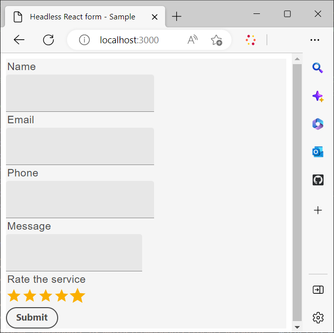

# Verwenden einer benutzerdefinierten React-Bibliothek zum Rendern eines Headless-Formulars

<!-- This article is completely missing the image ALT tags (descriptions) for each added image asset. That is impacting the CQI score for Experience Manager in a negative way. Be sure you add the required missing image ALT tags.  -->

Sie können benutzerdefinierte Komponenten erstellen und implementieren, um das Erscheinungsbild und die Funktionalität (Verhalten) Ihrer adaptiven Headless-Formulare gemäß den Anforderungen und Richtlinien Ihres Unternehmens anzupassen.

Diese Komponenten dienen hauptsächlich dazu, das Erscheinungsbild oder den Stil von Formularfeldern festzulegen und die über diese Felder erfassten Daten in der Formularmodellinstanz zu speichern. Wenn dies verwirrend klingt, keine Sorge - Sie werden diese Zwecke in Kürze detaillierter erkunden. Zunächst konzentrieren wir uns auf die ersten Schritte: Erstellen benutzerdefinierter Komponenten, Rendern des Formulars mithilfe dieser Komponenten und Verwenden von Ereignissen zum Speichern und Senden von Daten an einen REST-Endpunkt.

In diesem Tutorial werden Komponenten der Google Material-Benutzeroberfläche verwendet, um zu demonstrieren, wie ein Headless-adaptives Formular mithilfe von benutzerdefinierten React-Komponenten gerendert werden kann. Sie sind jedoch nicht auf diese Bibliothek beschränkt und können beliebige React-Komponentenbibliotheken verwenden oder eigene benutzerdefinierte Komponenten entwickeln.

Nach Abschluss dieses Artikels erhält der Artikel _Contact Us_ , der in [Erstellen und Veröffentlichen eines Headless-Formulars mit dem Starter Kit](create-and-publish-a-headless-form.md) erstellt wurde, folgende Fassung:




Die wichtigsten Schritte beim Rendern eines Formulars mit den Komponenten der Google Material-Benutzeroberfläche:


## &#x200B;1. Installieren der Google Material-Benutzeroberfläche

Standardmäßig verwendet das Starterkit [Adobe Spectrum](https://spectrum.adobe.com/)-Komponenten. Konfigurieren wir sie für die Verwendung der [Google Material-Benutzeroberfläche](https://mui.com/):

1. Stellen Sie sicher, dass das Starterkit nicht ausgeführt wird. Um das Starter Kit zu stoppen, öffnen Sie Ihr Terminal, navigieren Sie zu **react-starter-kit-aem-headless-forms** und drücken Sie Strg-C (unter Windows, Mac und Linux® ist es dasselbe).

   Versuchen Sie nicht, das Terminal zu schließen. Durch Schließen Ihres Terminals wird das Starterkit nicht gestoppt.

1. Führen Sie den folgenden Befehl aus:

```shell
    
    npm install @mui/material @emotion/react @emotion/styled --force
    
```

Dadurch werden die npm-Bibliotheken der Google Material-Benutzeroberfläche installiert und zu den Abhängigkeiten des Starterkits hinzugefügt. Sie können Formularkomponenten jetzt mit den Komponenten der Material-Benutzeroberfläche rendern.


## &#x200B;2. Erstellen benutzerdefinierter React-Komponenten

Erstellen wir eine benutzerdefinierte Komponente, die die standardmäßige Komponente [Texteingabe](https://spectrum.adobe.com/page/text-field/) durch die Komponente [Textfeld der Google-](https://mui.com/material-ui/react-text-field/) ersetzt.

Für jeden Komponententyp (fieldType oder [), ](https://opensource.adobe.com/aem-forms-af-runtime/storybook/?path=/story/reference-json-properties-fieldtype--text-input) `:type` in einer Headless-Formulardefinition verwendet wird, ist eine separate Komponente erforderlich. Beispielsweise sind im Kontaktformular, das Sie im vorherigen Abschnitt erstellt haben, die Felder Name, E-Mail und Telefon vom Typ `text-input` ([fieldType: &quot;text-input&quot;](https://opensource.adobe.com/aem-forms-af-runtime/storybook/?path=/docs/adaptive-form-components-text-input-field--def)) und das Meldungsfeld vom Typ `multiline-input` ([&quot;fieldType&quot;: &quot;multiline-input&quot;](https://opensource.adobe.com/aem-forms-af-runtime/storybook/?path=/docs/reference-json-properties-fieldtype--multiline-input)).


Erstellen wir eine benutzerdefinierte Komponente, um alle Formularfelder, die die Eigenschaft „fieldType[ „text-input“ ](https://opensource.adobe.com/aem-forms-af-runtime/storybook/?path=/docs/adaptive-form-components-text-input-field--def), mit der Komponente &quot;[ UI Text Field](https://mui.com/material-ui/react-text-field/) zu überlagern.


So erstellen Sie die benutzerdefinierten Komponente und ordnen sie der Eigenschaft [fieldType](https://opensource.adobe.com/aem-forms-af-runtime/storybook/?path=/docs/adaptive-form-components-text-input-field--def) zu:

1. Öffnen Sie das Verzeichnis **react-starter-kit-aem-headless-forms** in einem Code-Editor und navigieren Sie zu `\react-starter-kit-aem-headless-forms\src\components`.


1. Erstellen Sie eine Kopie des **`slider`** oder **`richtext`** Ordners und benennen Sie den kopierten Ordner in **materialTextField** um. `slider` und `richtext` sind zwei Beispiele für benutzerdefinierte Komponenten, die in der Starter-App verfügbar sind. Sie können diese Komponenten verwenden, um Ihre eigenen benutzerdefinierten Komponenten zu erstellen.

   

1. Öffnen Sie die Datei `\react-starter-kit-aem-headless-forms\src\components\materialtextfield\index.tsx` und ersetzen Sie den vorhandenen Code durch folgenden Code. Dieser Code gibt eine Komponente [Textfeld der Google Material-Benutzeroberfläche](https://mui.com/material-ui/react-text-field/) zurück und rendert sie

```JavaScript
 
     import React from 'react';
     import {useRuleEngine} from '@aemforms/af-react-renderer';
     import {FieldJson, State} from '@aemforms/af-core';
     import { TextField } from '@mui/material';
     import Box from '@mui/material/Box';
     import { richTextString } from '@aemforms/af-react-components';
     import Typography from '@mui/material/Typography';


     const MaterialtextField = function (props: State<FieldJson>) {

         const [state, handlers] = useRuleEngine(props);

         return(

         <Box>
             <Typography component="legend">{state.visible ? richTextString(state?.label?.value): ""} </Typography>
             <TextField variant="filled"/>
         </Box>

         )
     }

     export default MaterialtextField;
```


Der Teil `state.visible` überprüft, ob die Komponente als sichtbar festgelegt ist. Ist dies der Fall, wird die Feldbeschriftung abgerufen und mit `richTextString(state?.label?.value)` angezeigt.


Ihre benutzerdefinierte Komponente `materialtextfield` ist bereit. Legen wir diese benutzerdefinierte Komponente fest, um alle Instanzen von [fieldType: &quot;text-input&quot;](https://opensource.adobe.com/aem-forms-af-runtime/storybook/?path=/docs/adaptive-form-components-text-input-field--def) durch „Textfeld der Google Material-Benutzeroberfläche“ zu ersetzen.

## &#x200B;3. Ordnen Sie Headless-Formularfeldern benutzerdefinierten Komponenten zu

Der Prozess der Verwendung von Bibliothekskomponenten von Drittanbietern zum Rendern von Formularfeldern wird als Zuordnung bezeichnet. Sie ordnen jede [fieldType](https://opensource.adobe.com/aem-forms-af-runtime/storybook/?path=/story/reference-json-properties-fieldtype--text-input) einer entsprechenden Komponente einer Drittanbieterbibliothek zu.

Alle zuordnungsbezogenen Informationen werden zur Datei `mappings.ts` hinzugefügt. Die `...mappings`-Anweisung in der `mappings.ts` bezieht sich auf die Standardzuordnungen, die die ([fieldType](https://opensource.adobe.com/aem-forms-af-runtime/storybook/?path=/story/reference-json-properties-fieldtype--text-input) oder `:type`) mit [Adobe Spectrum](https://spectrum.adobe.com/page/text-field/)-Komponenten überlagern.

So ordnen Sie die im letzten Schritt erstellte `materialtextfield`-Komponente zu:

1. Öffnen Sie die Datei `mappings.ts`.

1. Fügen Sie folgende Importanweisung hinzu, um die Komponente `materialtextfield` in die Datei `mappings.ts` einzuschließen.


   ```JavaScript
       import MaterialtextField from "../components/materialtextfield";
   ```

1. Fügen Sie folgende Anweisung hinzu, um den `text-input` der Komponente „materialtextfield“ zuzuordnen.


   ```JavaScript
       "text-input": MaterialtextField
   ```

   Der endgültige Code der Datei sieht wie folgt aus:

   ```JavaScript
         import { mappings } from "@aemforms/af-react-components";
         import MaterialtextField from "../components/materialtextfield";
   
   
         const customMappings: any = {
           ...mappings,
           "text-input": MaterialtextField
        };
        export default customMappings;
   ```

1. Speichern Sie die App und führen Sie sie aus. Die ersten drei Felder des Formulars werden mithilfe des [Textfelds der Google Material-Benutzeroberfläche](https://mui.com/material-ui/react-text-field/) erstellt:

   


   Ebenso können Sie benutzerdefinierte Komponenten für die Felder „message“ („fieldType“: „multiline-input„) und „rate“ für den Dienst („fieldType“: „number-input„) erstellen. Sie können das folgende Git-Repository für benutzerdefinierte Nachrichtenkomponenten klonen und die Dienstfelder bewerten:

   [https://github.com/singhkh/react-starter-kit-aem-headless-forms](https://github.com/singhkh/react-starter-kit-aem-headless-forms)

## Nächster Schritt

Sie haben das Formular erfolgreich mit benutzerdefinierten Komponenten, die die Google Material-Benutzeroberfläche verwenden, gerendert. Haben Sie versucht, das Formular zu senden, indem Sie auf die Senden-Schaltfläche geklickt haben (der entsprechenden Google Material-UI-Komponente zugeordnet)? Wenn nicht, versuchen Sie es.

Sendet das Formular die Daten an eine Datenquelle? Nein? Machen Sie sich keine Sorgen. Der Grund dafür ist, dass das Formular nicht für die Kommunikation mit der Laufzeitbibliothek konfiguriert ist.

Wie können Sie Ihr Formular so konfigurieren, dass es mit ihr kommuniziert? Bald wird ein Artikel erscheinen, in dem alles im Detail erklärt wird. Bleiben Sie dran!
